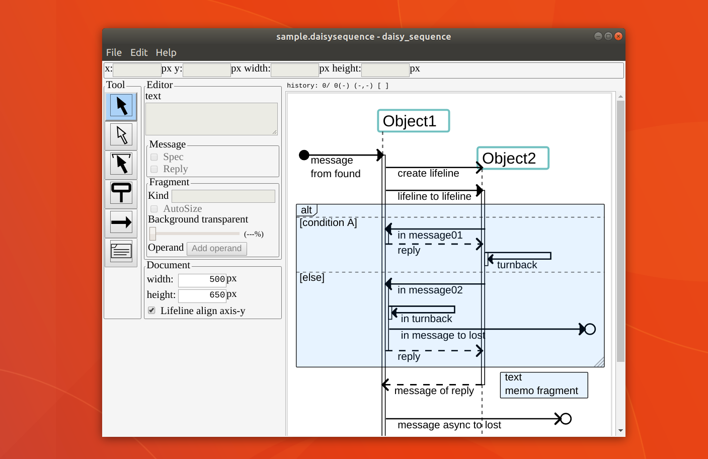

daisy sequence
====
daisy sequence is (not) UML sequence diagram editor.  

# 概要
daisy sequenceは、Win/Mac/Linuxで動作する、シーケンス図エディタです。  

  

## 特徴
- マルチプラットフォーム(Windows/Mac/Linux)
- 印刷/HiDPIにも使えるSVG/PNG書き出し
- CLIからの書き出し処理によるCI連携が可能
- バージョン管理しやすいJSONテキストベースのネイティブファイルフォーマット

# Download
[Download for latest release](https://github.com/MichinariNukazawa/daisy_sequence/releases)  

# License
配布パッケージの利用と再配布は、個人/企業/商用/非商用に関わらず無償  
ソースコードの改変利用は、個人は無償、企業は有償ライセンス  

コントリビュートの際はライセンスに同意する必要があります  

# Feature
- Edit elements(Lifeline, Message, ExecutionSpecification (spec), Fragment, Operand)
- Export for SVG/PNG
- CLI export (notice: non headless)

## TODO
- More usefull editor
- Auto save backup
- Auto positioning (ex. fix Messages between height, Fragment overwrap relocation)
- UML Strict Mode (need you?)
- design customize (CSS based)

