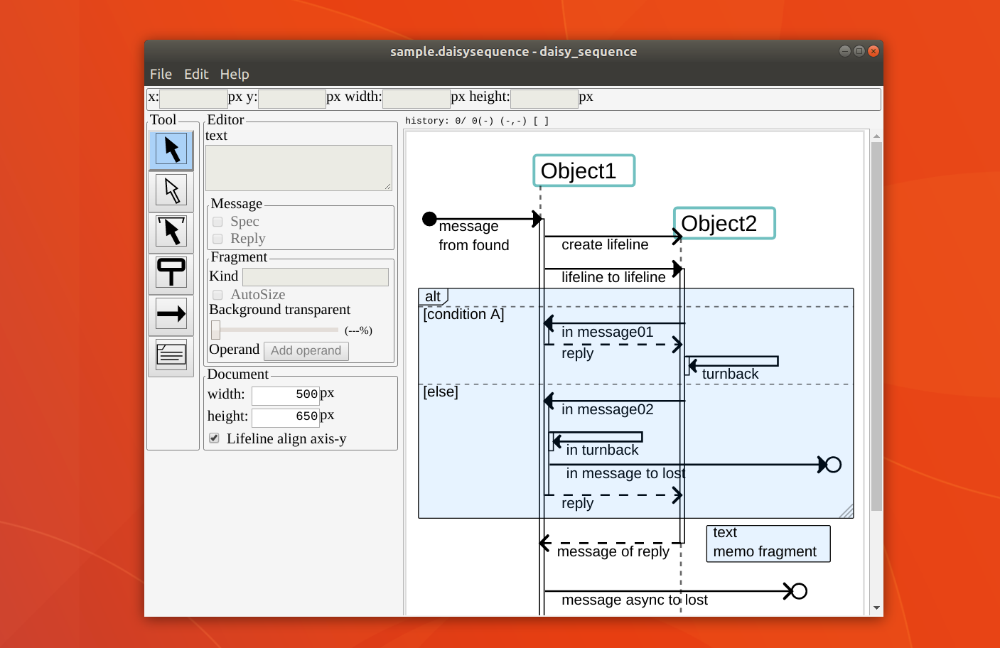

daisy\_sequence ユーザマニュアル
====
daisy\_sequence is (not) UML sequence diagram editor.  

# 概要
daisy\_sequenceは、Win/Mac/Linuxで動作する、フリーのシーケンス図エディタです。  

  

## 特徴
- マルチプラットフォーム(Windows/Mac/Linux)  
- 印刷/HiDPIにも使えるSVG/PNG書き出し  
- CLIからの書き出し処理によるCI連携が可能  
- PlantUML書き出し  
- バージョン管理しやすいJSONテキストベースのネイティブファイルフォーマット  

## License
- 配布パッケージの利用と再配布は、個人/企業/商用/非商用に関わらず無償です  
- ソースコードの改変利用は、個人は無償、企業は有償ライセンスが必要です  
- 本アプリケーションは無保証で提供されます  

ライセンスは予告なく更新される場合があります。最新版は[githubの開発リポジトリ](https://github.com/MichinariNukazawa/daisy_sequence/)を参照ください。  

# Download
[Download for latest release](https://github.com/MichinariNukazawa/daisy_sequence/releases)  

# Sequence diagram Overwiew
Sequence Diagramは、主にLifeline, Message, Spec, Fragmentからなります。  
これら要素を本ドキュメントではElementと総称します。  

  

## Spec
Messageに付随する、Lifelineまたは処理がアクティブである旨の表示です。

## Fragment
メモおよび条件分岐等を総合したものです。  
(daisy\_sequenceではこれらの種別を区別していません。)  

## Operand
Fragment内の仕切りです。条件分岐などの表現に使用します。  

# Application Overwiev
daisy\_sequenceのアプリケーション画面です。

  

## Tool Panel
Toolを選択するPanelです。  
  

### Element Tool
  
Elementを選択・移動・リサイズします。  
Fragmentを移動すると、範囲に含まれるMessageも連動して移動します。  

### Simple Element Tool
  
Elementを選択・移動・リサイズします。  
Element Toolと違い、他のElementが連動しません。選択したElementのみ操作したい場合に使います。  

### Move Height Tool
  
マウスポインタの位置より下にあるすべてのElementを縦移動します。  
ドキュメントの縦サイズも合わせて変更します。  
シーケンス図にMessageを追加する際に領域を空けたり、削除する際に空いた領域を詰めることができます。  

### Add Lifeline Tool
  
Lifelineを追加します。  

### Add Message Tool
  
Messageを追加します。  

### Add Fragment Tool
  
Fragmentを追加します。  

## Edit Panel
Elementの位置を数値で指定します。  
  

## Editor Panel
Elementの属性を編集します。  
  

### Text
Lifelineの名前、Message、FragmentあるいはOperandの内容を編集します。  

### Message Kind
以下の種類から指定します。  
- sync, async: 同期・非同期メッセージです。矢印の先の形状が異なります。  
- create: Lifelineを作成するMessageです。Lifelineの開始位置がこのMessageの高さになります。  
- stop: Lifelineを停止するMessageです。LifelineのこのMessageの高さにバツアイコンが付きます。  

### Message Spec
Messageが指す先のLifelineについて、処理を行っているactiveな範囲を太線で示す、Specを追加します。  

### Message Reply
Messageが指した先が処理を終了し、元のLifelineに処理を戻すことを示す、Reply Messageを追加します。  

### Fragment Kind
Fragmentの先頭に表示する文字列を指定します。  

Fragment Kindは、以下の予約語を指定し、記法に従うことで、PlantUML書き出しの際にNote以外であることが考慮されて書き出されます。  
予約語: `loop, opt, break, critical, ref, alt, par`  
Fragmentの記法: `(予約語) ([条件式])?`  
 (条件式はAltなど条件式が有効な予約語を持つFragmentである場合のみ有効)  

### Auto Size
Fragmentのサイズが、Textが収まるよう自動調整されます。  

### Background transparent
Fragmentの背景の透明度を指定します。  

### Add Operand
FragmentにOperandを追加します。  
Fragmentの中に、Operandは任意の数だけ追加できます。  

Operandは以下の記法に従うことで、PlantUML書き出しの際に考慮されて書き出されます。  
Operandの記法: `[条件式]`  
 (条件式はAltなど条件式が有効な予約語を持つFragmentである場合のみ有効)  

### Document width/height
シーケンス図ドキュメントのサイズを指定します。  

### Lifeline align axis-y
Lifelineのデフォルトの開始位置の高さを揃えます。  

## Canvas
シーケンス図を描画します。
  

### Information
以下のInformationを表示します。  
- ヒストリ `現在のインデックス/ヒストリ総数 (最後のヒストリ操作)`  
- Canvas上のマウスポインタ位置 `(x, y)`  
- 現在のマウス操作状態と指しているElementの内部ID(デバッグ情報) `none [id]`  

## Menu
主要な項目を解説します。というか、必要なさそうないくつかの説明を飛ばします。  

  

### File>PlantUML
PlantUML形式で書き出します。  
(PlantUML書き出しの際、FragmentはFragment KeywordからPlantUMLのキーワードを探してPlantUMLの記法に変換します。)  

  

### Edit>All/None/Invert
ElementへのFocusを変更します。それぞれ、全選択、全選択解除、選択を反転、です。  

### Edit>Raise/Rower
Elementの並び順を並び替えます。  
現在のdaisy\_sequenceはElementを種類ごとに描画しているので、並び替えは描画に完全には反映されません。  
また、Message\>Spec\>ReplyMessageの順序関係は保持されるべきです。  

### Edit>Delete Element(s)
FocusしているElementを削除します。  

# CLI
コマンドライン・インターフェースです。エンジニアなら垂涎ものですがそうでない方には興味のないものです。(つまりあなたはいま涎を垂らしている。)  

  

コマンドライン: `daisy\_sequence.exe [OpenFilePath [-o ExportFilePath]]`  

オプション  
- OpenFilePath:  
.daisysequence(ネイティブファイルフォーマット)を開きます。  
OpenFilePathのみ指定した場合は、ファイルを開いた状態でGUIが起動します。  
- ExportFilePath: .puml(PlantUMLファイルフォーマット)、.svgで書き出します。  
`-o`の後にファイルパスを指定しない場合エラーとなります。  
ExportFilePathを指定した場合、書き出し後、アプリケーションは正常終了します。  

注意: 現在のdaisy\_sequenceはヘッドレスモードを持っていません。つまりCLI操作でも一時的にGUIが起動します。  
この挙動はXウィンドウのないCIサーバのような環境で問題になるかもしれません。その場合はStaskOverflowに解決策があったと思うので調べると良いと思います。  

